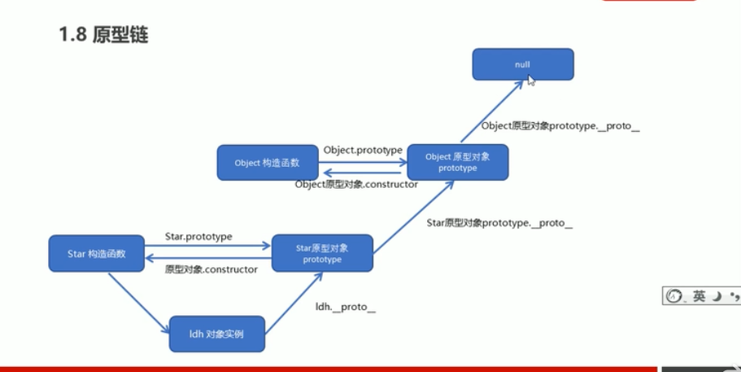
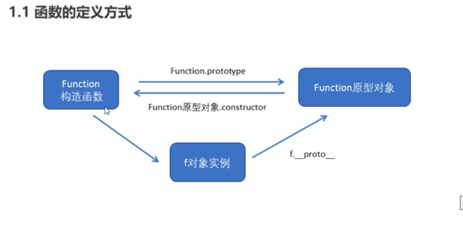

## js高级Es6
### 面向对象
- 封装性 继承 多态类似java
- 类class 对象new
```js
 class Father {
            constructor(x, y) {
                this.x = x;
                this.y = y;
            }
            sum() {
                console.log(this.x + this.y);
            }
        }
        class Son extends Father {
            constructor(x, y) {
                super(x, y); //调用了父类中的构造函数
            }                 //也可以调用普通函数super.say()
        }
        var son = new Son(1, 2);
        son.sum();
```
- ES5创建对象
    - 构造函数 function Start(name,age){s属性 方法}
    - 构造函数原型prototype
    - 构造函数和原型对象相互引用
```js
function Star(uname, age) {
    this.uname = uname;
    this.age = age;
 }
// Star.prototype.sing = function() {
//     console.log('我会唱歌');
// }
Star.prototype = {
    // 如果我们修改了原来的原型对象,给原型对象赋值的是一个对象,则必须手动的利用constructor指回原来造函数
    constructor: Star,
    sing: function() {
        console.log('我会唱歌');
    },
       movie: function() {
        console.log('我会演电影');
    }
}
var ldh = new Star('刘德华', 18);
ldh.sing();
// 对象身上系统自己添加一个 __proto__ 指向我们构造函数的原型对象 prototype
console.log(ldh.__proto__ === Star.prototype);
// 方法的查找规则: 首先先看ldh 对象身上是否有 sing 方法,如果有就执行这个对象上的sing
// 如果么有sing 这个方法,因为有__proto__ 的存在,就去构造函数原型对象prototype身上去查找sing这个方法
```
- 原型
    - 函数function都有一个prototype，显式原型（属性）  原型对象
    - 每一个实例对象都有一个__proto__，隐式原型（属性） 对象原型
    - 实例对像的隐式原型=构造函数的显式原型

- 实例化对象
    - 构造函数里面写属性，其prototype里面写方法
    - 实例化对象，其__proto__指向其构造函数的prototype，这个prototype里的construc指向该构造函数。实例利用构造函数实例化
- 原型链
    - 所有函数都是Function的实例（包含Function）
    - 函数的显示原型指向的对象默认是空Object实例对象，空Object实例对象的隐式原型指向Object函数的显示原型。
    - Object函数显示原型指向的对象默认是空Object实例对象，这个空Object实例对象隐式原型指向NULL
    - Object的原型对象是原型链的尽头

- 扩展内置对象
    - 在原型对象中添加方法，直接调用
- 继承：组合继承:构造函数+原型对象
    - call()
        - 改变函数的this指向
        - 借用父构造函数继承属性
    - 利用构造函数继承属性、利用原型对象继承方法
```js
// 借用父构造函数继承属性
        // 1. 父构造函数
        function Father(uname, age) {
            // this 指向父构造函数的对象实例
            this.uname = uname;
            this.age = age;
        }
        Father.prototype.money = function() {
            console.log(100000);
        };
        // 2 .子构造函数 
        function Son(uname, age, score) {
            // this 指向子构造函数的对象实例
            Father.call(this, uname, age);
            this.score = score;
        }
        // Son.prototype = Father.prototype;  这样直接赋值会有问题,如果修改了子原型对象,父原型对象也会跟着一起变化
        Son.prototype = new Father();
        // 如果利用对象的形式修改了原型对象,别忘了利用constructor 指回原来的构造函数
        Son.prototype.constructor = Son;
        // 这个是子构造函数专门的方法
        Son.prototype.exam = function() {
            console.log('孩子要考试');
        }
        var son = new Son('刘德华', 18, 100);
```
- 数组方法
    - forEach(function(value,index,array))
    - filter过滤器、筛选数组-----filter(function(value,index,array){return value >= 1})返回符合条件的数组
    - some检测数组中元素满足条件，返回布尔值
- 字符串方法
    - trim去除字符串两侧空格
- 对象方法
    - object.keys()获取对象的属性名，返回数组
    - Object.defineProperty(对象，属性，说明{})设置属性，可修改等等
### 函数进阶
- 函数定义
    - function fn(){};命名函数
    - var fun = function(){};匿名函数
    - var f = new function('a','b','console.log(a+b)');利用构造函数
    - 所有函数都是Function的实例(对象)
    - 万物对象


- 函数调用
    - fn(); fn.call(); o.sayHi();
    - 调用构造函数--new start();
    - 立即执行函数(function() {console.log('我爱你');})();
- 函数内部this指向
    - call()
    - apply(this,[])参数为数组形式
    - bind()不调用函数，改变this，返回原函数改变this的新函数
        - 用的多，
    - 总结：call和apply调用函数，call传递aru1，aru2。apply传递数组[arg]
        - call继承
        - apply数组
        - bind不调用函数，改变this，比如定时器
```js
var btns = document.querySelectorAll('button');
for (var i = 0; i < btns.length; i++) {
    btns[i].onclick = function() {
        this.disabled = true;
        setTimeout(function() {
            this.disabled = false;
        }.bind(this), 2000);  //bind的使用
    }
}
```
- 严格模式
    - 'use strict' 为整个script
    - 变化\加上严格模式
        - 变量必须声明
        - 严禁删除已经声明的变量
        - 全局作用域中函数this是undefined
        - 构造函数不加new调用，this报错。new实例化的构造函数指向创建的对象实例。
        - 函数中不能重名参数
        - 函数声明在顶层，不允许在非函数的代码块内声明函数
- 高阶函数
    - 一个函数接收函数作为参数或将函数作为返回值输出
    - 回调函数
- 闭包closure
    - 有权访问另一个函数作用域中变量的函数。被访问的变量所在的函数为闭包函数
    - 闭包作用：延伸变量的作用范围
    - 立即执行函数（小闭包）
```js
        // 闭包应用-点击li输出当前li的索引号
        // 1. 我们可以利用动态添加属性的方式
        var lis = document.querySelector('.nav').querySelectorAll('li');
        for (var i = 0; i < lis.length; i++) {
            lis[i].index = i;
            lis[i].onclick = function() {
                // console.log(i);
                console.log(this.index);

            }
        }
        // 2. 利用闭包的方式得到当前小li 的索引号
        for (var i = 0; i < lis.length; i++) {
            // 利用for循环创建了4个立即执行函数
            // 立即执行函数也成为小闭包因为立即执行函数里面的任何一个函数都可以使用它的i这变量
            (function(i) {
                // console.log(i);
                lis[i].onclick = function() {
                    console.log(i);

                }
            })(i);
        }
```
- 递归
    - 函数内部自己调用自己，容易发生栈溢出，加退出条件。
    - 
```js
        // 利用递归函数求1~n的阶乘 1 * 2 * 3 * 4 * ..n
        function fn(n) {
            if (n == 1) {
                return 1;
            }
            return n * fn(n - 1);
        }
        console.log(fn(3));
```
```js
        var data = [{
            id: 1,
            name: '家电',
            goods: [{
                id: 11,
                gname: '冰箱',
                goods: [{
                    id: 111,
                    gname: '海尔'
                }, {
                    id: 112,
                    gname: '美的'
                }, ]
            }, {
                id: 12,
                gname: '洗衣机'
            }]
        }, {
            id: 2,
            name: '服饰'
        }];
        // 我们想要做输入id号,就可以返回的数据对象
        // 1. 利用 forEach 去遍历里面的每一个对象
        function getID(json, id) {
            var o = {};
            json.forEach(function(item) {
                // console.log(item); // 2个数组元素
                if (item.id == id) {
                    // console.log(item);
                    o = item;
                    // 2. 我们想要得里层的数据 11 12 可以利用递归函数
                    // 里面应该有goods这个数组并且数组的长度不为 0 
                } else if (item.goods && item.goods.length > 0) {
                    o = getID(item.goods, id);
                }

            });
            return o;
        }
```
- 浅拷贝
    - 拷贝一层，更深层次的对象级别的只拷贝引用、地址
    - Object.assign(target,sources)  es6新增浅拷贝
- 深拷贝 
```js
 var obj = {
            id: 1,
            name: 'andy',
            msg: {
                age: 18
            },
            color: ['pink', 'red']
        };
        var o = {};
        // 封装函数 
        function deepCopy(newobj, oldobj) {
            for (var k in oldobj) {
                // 判断我们的属性值属于那种数据类型
                // 1. 获取属性值  oldobj[k]
                var item = oldobj[k];
                // 2. 判断这个值是否是数组
                if (item instanceof Array) {
                    newobj[k] = [];
                    deepCopy(newobj[k], item)
                } else if (item instanceof Object) {
                    // 3. 判断这个值是否是对象
                    newobj[k] = {};
                    deepCopy(newobj[k], item)
                } else {
                    // 4. 属于简单数据类型
                    newobj[k] = item;
                }
            }
        }
        deepCopy(o, obj);
```
### 正则表达式
- 正则表达式概述
    - js匹配字符串中字符组合模式
    - 作用：验证表单、过滤敏感词汇、获取字符串特定部分（提取）
- 使用
    - RegExp构造函数 var regexp = new RegExp(/123/); var rg = /123/; 
    - rg.test('abc') 里面为要检测的文本str
- 括号总结
    - {}表示重复次数
    - []匹配括号中的任意字符
    - ()优先级
- 预定义类
    - /d--[0-9]  /D取反
    - /w字母数字下划线
    - /s空格
    - replace)(reg/str,new)
    - /正则表达式/[switch]--g；全局匹配、i:忽略大小写、gi
### ES6
- let
    - let声明的变量在所处的块级有效
    - 不存在变量提升，先声明，再使用。
    - 暂时性死区
- const
    - 声明常量，就是值(内存地址)不能变化的量
    - 具有块级作用域
    - 必须赋值
    - 值不可更改（实际地址不能改）
- 解构赋值
    - 数组解构
        - let [A,B,C]=[1,2,3]
    - 对象解构
        - let person = {name: 'lisi', age: 30, sex: '男'};
		- let { name, age, sex } = person;匹配变量
        - let {name: myName} = person;匹配属性，重新赋值给新变量
- 箭头函数
    - (参数)=>{} 简化函数定义
    - 函数体中一句代码，并且代码执行结果就是返回值，可以省略大括号
    - 只有一个形参，省略小括号
    - 不绑定this，
    - 对象不产生作用域
- 剩余参数
    - 将不定量的参数表示为一个数组 const sum = (...args)=>{}
- 扩展运算符 
    - 将数组拆分为以逗号分隔的参数序列
    - 合并数组
    - 伪数组转换为数组
```js
let ary = ["a", "b", "c"];
console.log(...ary)

let ary1 = [1, 2, 3];
let ary2 = [4, 5, 6];
let ary3 = [...ary1, ...ary2];

let ary1 = [1, 2, 3];
et ary2 = [4, 5, 6];
ary1.push(...ary2);

var oDivs = document.getElementsByTagName('div');
console.log(oDivs)
var ary = [...oDivs];
ary.push('a');//可以用数组的方法了
```
- Array的扩展方法
    - Array.from(伪数组)转换伪数组
    - find() findIndex()
    - includes()
- 模板字符串
    - 使用反引号`
    - 解析变量
```js
let name = `张三`;
let sayHello = `Hello, 我的名字叫${name}`;
console.log(sayHello);

let result = {
	name: "zhangsan",
	age: 20
};
let html = `
	<div>
		<span>${result.name}</span>
		<span>${result.age}</span>
	</div>
`;
console.log(html);

const fn = () => {
	return '我是fn函数'
	}
let html = `我是模板字符串 ${fn()}`;
console.log(html);
```
-String扩展方法
    - startsWith()判断字符串是否以某字符串开头
    - endsWith()结尾
    - repeat()将字符串重复几次，返回一个新字符串
- Set数据结构
    - 